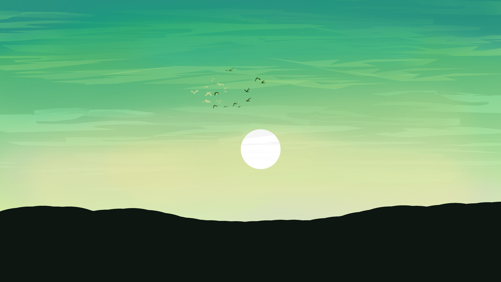
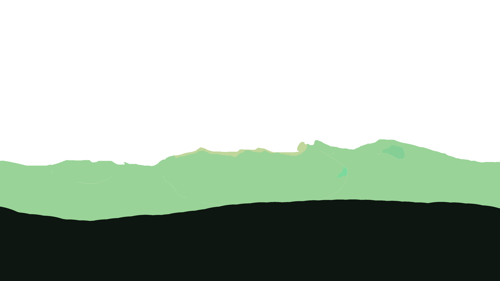
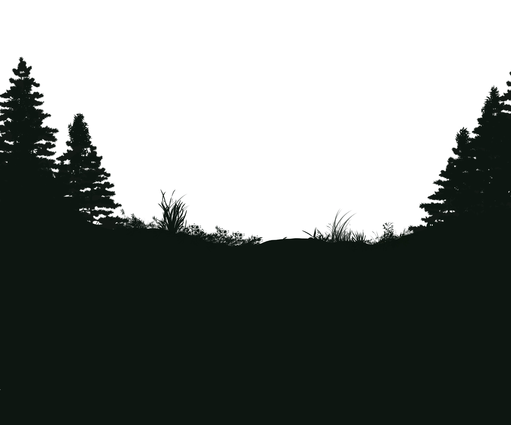

A quick test to make a parallax webpage using a custom drawing I made using Javascript.

Base song by Ghostrifter Offical. Additional audio was mixed from an open source audio 

## How the Parallax Effect Works

The Forest Lounge uses a **parallax scrolling effect** to create depth and immersion in the hero section. This is achieved by stacking multiple image layers (from background to foreground) and moving each layer at a different speed as the user scrolls.

### Implementation Details

- **Layering:** Images such as `sky.png`, `7.png`, ..., `1.png` are absolutely positioned on top of each other in the `.hero-parallax-container`.
- **Speed Control:** Each image has a `data-speed` attribute. Foreground layers have higher speed values, so they move faster than background layers.
- **JavaScript:** On scroll, a script calculates the scroll position and applies a vertical transform to each layer based on its speed. This makes closer (foreground) layers move more, while distant (background) layers move less.
- **Visual Effect:** The result is a smooth, animated scene where the forest appears three-dimensional and dynamic, enhancing the user's sense of immersion.

### Example

```html


...

```

```js
window.addEventListener('scroll', () => {
  const scrollY = window.scrollY;
  document.querySelectorAll('.hero-layer').forEach(layer => {
    const speed = parseFloat(layer.dataset.speed);
    layer.style.transform = `translateY(${scrollY * speed}px)`;
  });
});
```

### Heres a Fun Idea, negate the Data speed values of the different layers (Example 0.55 to -0.55)
